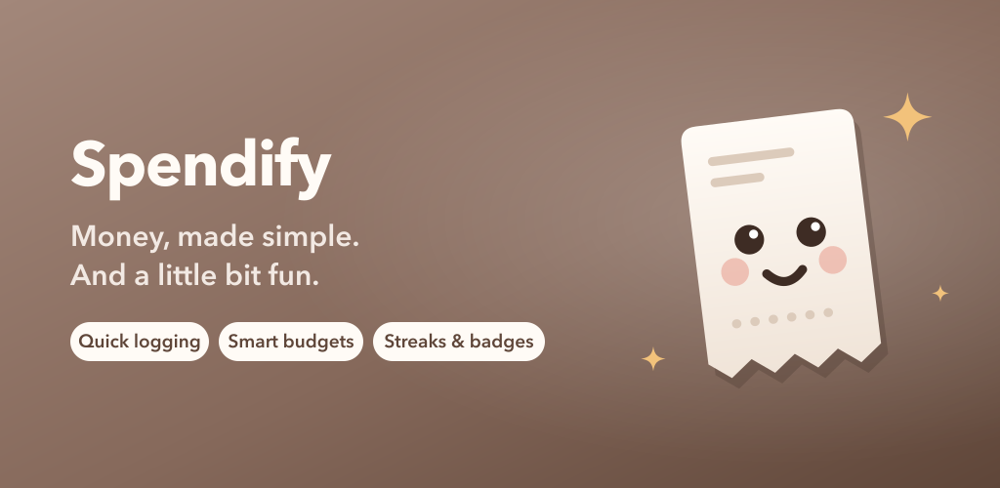
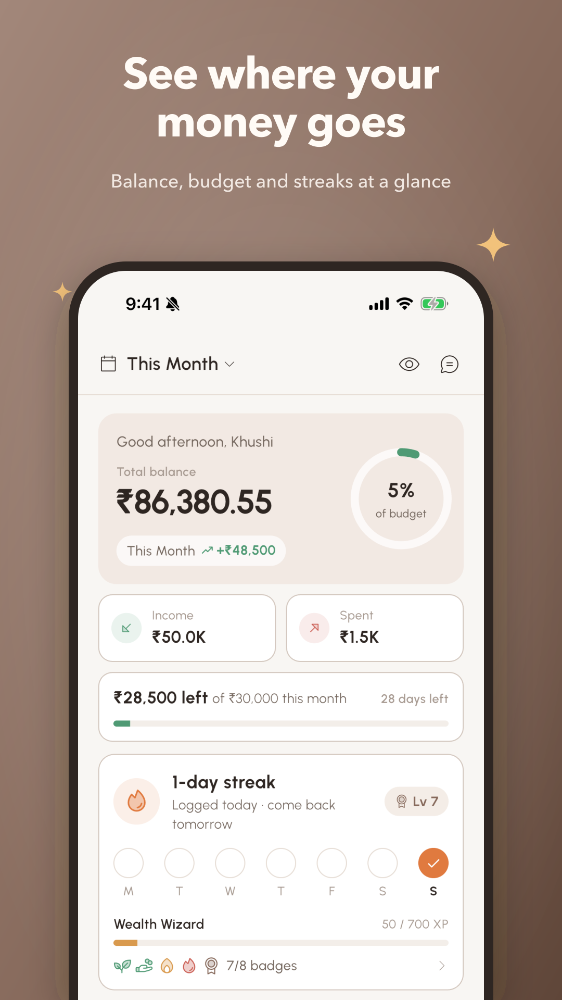
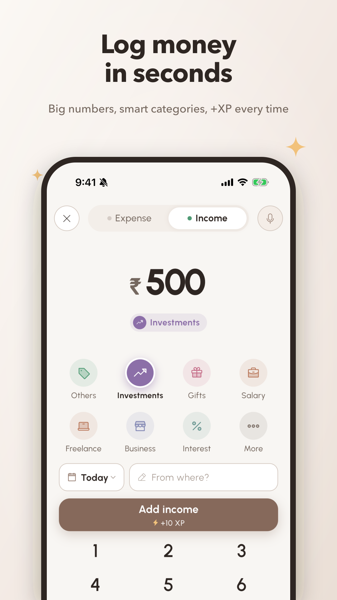
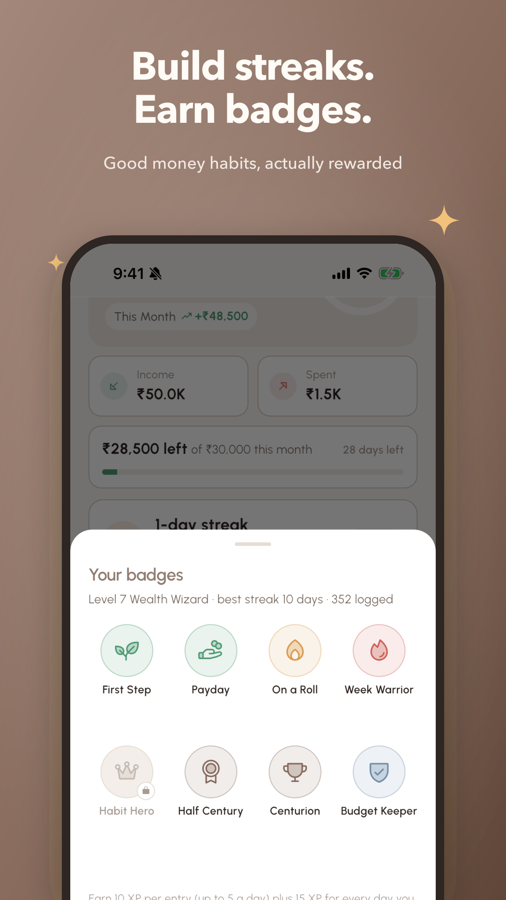
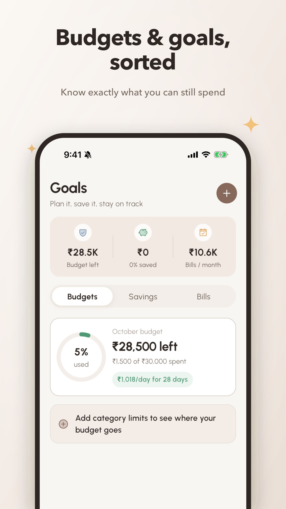
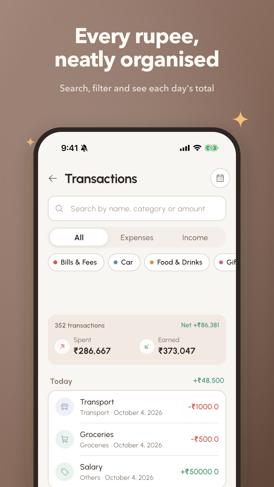
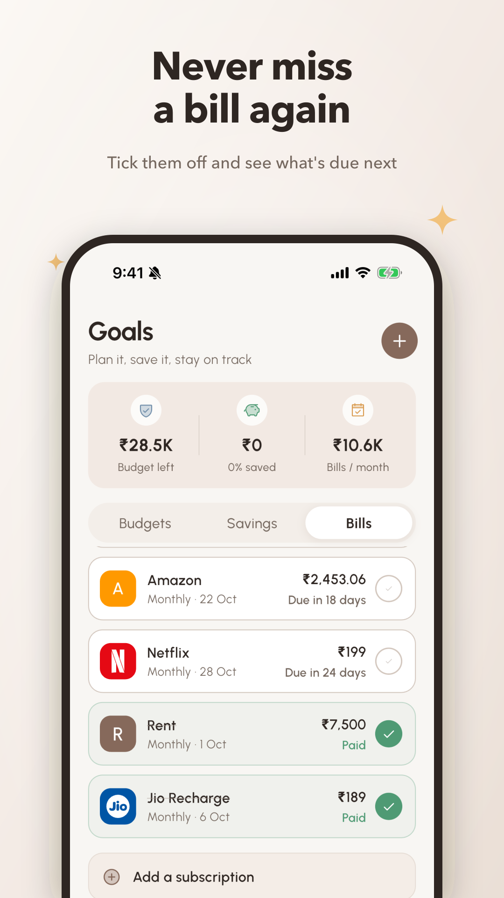

<p align="center">
  
</p>

<p align="center">
  
</p>

<h1 align="center">Spendify</h1>
<p align="center"><b>Money, made simple. And a little bit fun.</b><br/>
A warm, gamified expense tracker built with Flutter &amp; Supabase.</p>

<p align="center">
  <a href="https://spendify-in.netlify.app"><b>👉 Join early access on Android — spendify-in.netlify.app</b></a>
</p>

---

## Screenshots

<p align="center">
  
  
  
</p>
<p align="center">
  
  
  
</p>

---

## Get early access

Spendify is in **internal testing on Android**. Leave your email at **[spendify-in.netlify.app](https://spendify-in.netlify.app)** — no account needed — and you'll get a Google Play invite link as spots open. Use the Gmail on your Play Store so the invite works first time.

---

## Introduction

Spendify is a personal finance app that people actually *want* to open. It tracks income and expenses, budgets, savings goals, bills and group splits — and rewards the habit of tracking with streaks, XP, levels and badges. Everything runs on Supabase with a GetX architecture, wrapped in a calm, warm cream-and-mocha design.

---

## What's new

- **Warm redesign** — a cream & mocha design system with outlined cards, duotone icons and a frosted-glass quick-add menu, applied across Home, Goals, Splits, Transactions, the add screen, splash and onboarding.
- **Gamification** — logging streaks, XP, levels (Rookie Tracker → Wealth Wizard) and 8 badges. It rewards **logging, never spending**: XP is capped per day and streaks count the day an entry was *created*, so imports can't fake them.
- **Celebrations** — confetti, an animated badge, XP count-up and a pulsing streak flame after logging, creating goals/budgets/bills, savings milestones (25/50/75/100%) and paying bills.
- **Bills that work** — overdue detection, correct quarterly/yearly cycles, a tick-to-pay button, auto-marking when you log a matching expense, and dismissed suggestions that stay dismissed.
- **Honest insights** — budget projections that separate rent/one-offs from daily spend, fair month-over-month and weekend comparisons, and no misleading empty states.
- **New look, new mascot** — a smiling receipt mascot as the app icon, splash and store art.

---

## Features

### Home
- Period picker (today / week / month / year) and balance banner with a **budget ring** or 7-day spend sparkline
- Income / spent cards and a "₹X left of ₹Y this month" budget line
- **Streak & level card** with week dots, XP bar and badges
- Quick actions, insights card and recent activity grouped by day

### Add income / expense
- Sliding Expense / Income switch, large animated amount and a custom number pad
- Category grid ordered by **your most-used categories**; income has its own (Salary, Freelance, Refund…)
- Today / Yesterday / pick-a-date menu and an inline note
- Save button that tells you what's missing and previews the **XP & streak reward**
- Voice input — speak "450 on Swiggy dinner" and it fills amount, category and note

### Transactions
- Search by name, category **or amount**; All · Expenses · Income switch; category chips
- Summary of count, spent, earned and net across **all** matching entries
- Grouped by day (Today, Yesterday, dates) with each day's total; week calendar filter

### Goals
- **Budgets** — monthly budget ring with a safe-to-spend-per-day hint, plus per-category limits with On track / Near limit / Over status
- **Savings** — goals with emoji progress rings, 25/50/75/100% milestones and a suggested weekly pace
- **Bills** — month summary, calendar with brand logos, tick-to-pay list, auto-detected subscriptions

### Splits
- Groups with invite codes, equal or custom splits, who-owes-whom balances and settlements

### Insights
- Budget pace, spending vs the same days last month, top category, saving rate, logging gaps, no-spend days, biggest expense, weekend vs weekday and savings-goal deadlines

### Import & notifications
- SMS / UPI import with duplicate detection and review
- Budget alerts, bill reminders, goal deadlines, weekly digest and spend-spike alerts

### Onboarding & auth
- Google and Apple sign-in, plus email
- 4-step onboarding: currency, occupation, monthly budget and favourite categories

---

## Tech Stack

| Layer | Technology |
|---|---|
| Frontend | Flutter |
| State management | GetX |
| Backend & database | Supabase |
| Authentication | Supabase Auth (Google, Apple, email) |
| Charts | Syncfusion Flutter Charts |
| Icons | Phosphor (duotone) |
| Voice input | speech_to_text |
| SMS parsing | flutter_sms_inbox |
| Notifications | flutter_local_notifications |
| Email | Brevo |
| Home widget | home_widget |

---

## Project Structure

```
lib/
├── config/            # AppColor tokens & theme (light only)
├── controller/        # GetX controllers
├── model/             # Data models
├── services/          # Insights, progress (XP/streaks/badges), voice, SMS, notifications
├── view/
│   ├── auth/          # Login, register, forgot password
│   ├── home/          # Home dashboard
│   ├── wallet/        # Add transaction, transactions, statistics, SMS import
│   ├── goals/         # Budgets, savings goals & bills
│   ├── splits/        # Group expense splitting
│   ├── profile/       # Profile & settings
│   ├── onboarding/    # Onboarding flow
│   └── landing/       # Splash & get started
├── widgets/           # Reusable UI, incl. celebration.dart (confetti & rewards)
├── routes/            # Named routes
└── utils/             # Utilities

assets/brand/          # SVG sources for the app icon & mascot
store/                 # Play Store icon, feature graphic, screenshots & compose.py
```

---

## Setup

1. Clone the repository:
   ```bash
   git clone https://github.com/Ankit180898/spendify.git
   cd spendify
   ```
2. Create a `.env` file in the project root:
   ```
   SUPABASE_URL=your_supabase_url
   SUPABASE_ANONKEY=your_supabase_anon_key
   BREVO_API_KEY=your_brevo_api_key
   ```
3. Install dependencies and run:
   ```bash
   flutter pub get
   flutter run
   ```

> iOS requires a deployment target of **15.0** or newer. Google Sign-In on iOS reads `GIDClientID` / `GIDServerClientID` from `ios/Runner/Info.plist`.

---

## Brand & store assets

| Asset | Source | Regenerate |
|---|---|---|
| App icon (iOS, Android adaptive & themed) | `assets/brand/*.svg` | `rsvg-convert` the SVGs to `assets/`, then `dart run flutter_launcher_icons` |
| Play Store icon & feature graphic | `store/` | Re-export from `assets/brand/icon.svg` / `store/feature_graphic.svg` |
| Play Store screenshots | `store/raw/` (simulator captures) | `python3 store/compose.py` |

---

## Contributions

Contributions are welcome! Fork the repository and open a pull request. For bugs or feature requests, please open an issue on GitHub.

## License

This project is licensed under the MIT License — see the [LICENSE](LICENSE) file for details.
